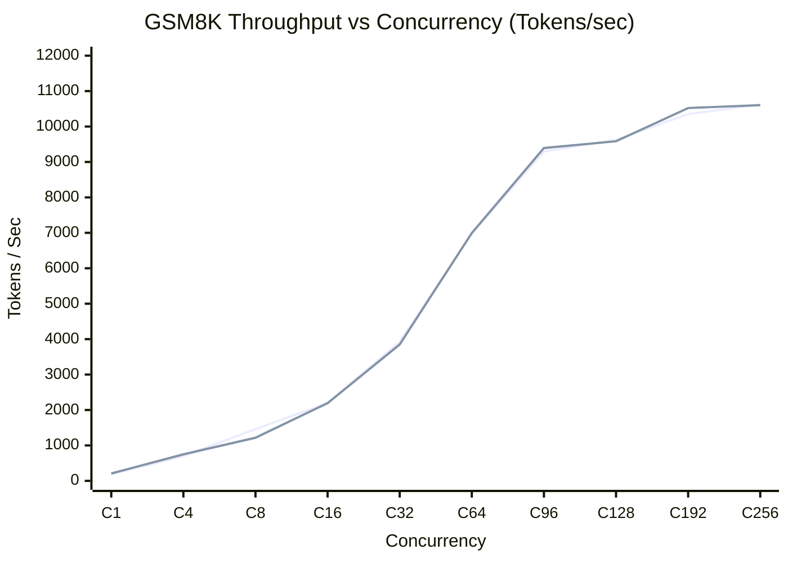
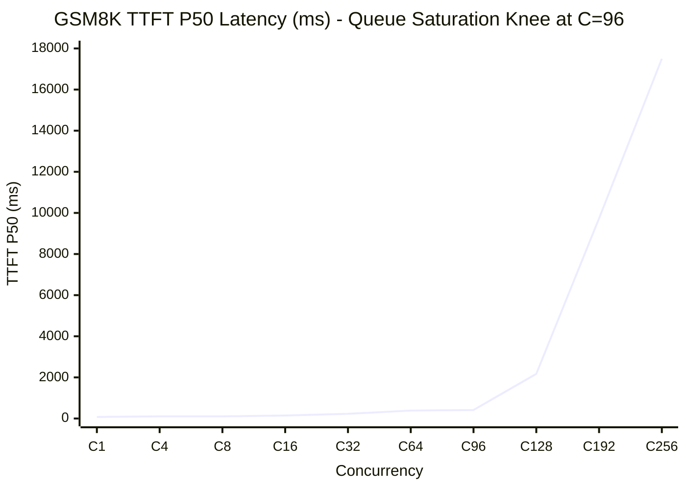
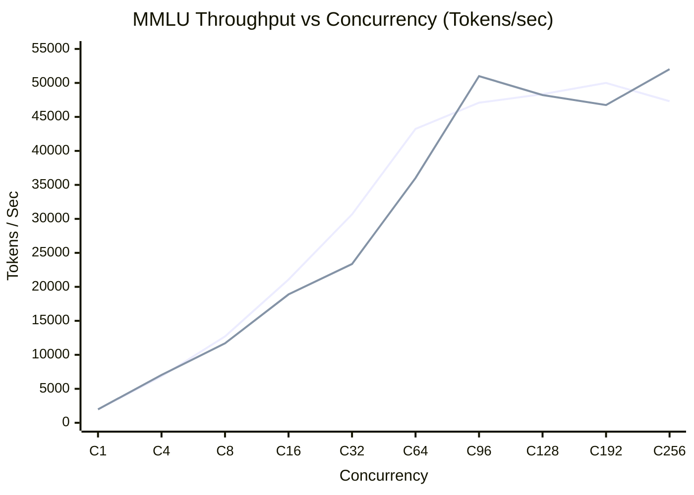
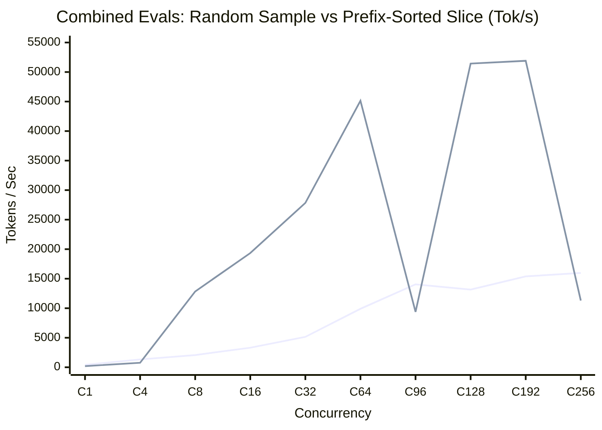

# vLLM Capacity Testing & Multi-Eval Efficiency Suite

An automated, in-cluster capacity testing and performance characterization harness for LLM serving pods deployed on Google Kubernetes Engine (GKE). It measures serving limits, Time-to-First-Token (TTFT), Time-per-Output-Token (TPOT), GPU KV-cache saturation, prefix cache hit rates, and identifies the optimal concurrency sweet spot ($C^*$) before running large-scale evaluation benchmarks (e.g., $\tau^2$-bench, GSM8K, MMLU).

---

## 1. Full Concurrency Ladder ($C \in [1, 4, 8, 16, 32, 64, 96, 128, 192, 256]$)

We evaluated the **Gemma 3 4B** (`vllm-server-gemma-3-4b`) pod on GKE (NVIDIA L4 24GB GPU) across **2,819 authentic academic benchmark samples** (1,319 GSM8K + 1,500 MMLU) across 10 concurrency tiers, dispatching up to **512 requests per tier**.

---

## 2. Empirical Results & Visual Efficiency Curves

### A. GSM8K Math Reasoning (CoT Generation ~256 tokens)





```
===================================================================================================================
 COMPARATIVE EFFICIENCY REPORT: GSM8K Math Reasoning
 Strategy A: Random Sample vs. Strategy B: Random Slice
===================================================================================================================
 Concurrency | Requests | Throughput (Tok/s)     | TTFT P50 (ms)          | Prefix Hit %     | Peak KV %
             |          | Random Sample | Random Slice | Random Sample | Random Slice | Random Sample | Random Slice | Random Sample / Random Slice
-------------+----------+------------------------+------------------------+------------------+------------------
 1           | 32       | 186.2      | 209.2      | 74.7       | 74.9       | 16.6%   | 17.9%   | 0.5% / 0.6%
 4           | 32       | 697.5      | 748.0      | 103.4      | 102.3      | 16.9%   | 16.4%   | 1.7% / 1.5%
 8           | 32       | 1460.7     | 1216.7     | 105.2      | 105.2      | 19.6%   | 16.8%   | 2.2% / 2.9%
 16          | 32       | 2196.4     | 2195.3     | 147.7      | 142.2      | 16.2%   | 18.9%   | 5.3% / 4.7%
 32          | 64       | 3922.9     | 3849.8     | 229.1      | 245.1      | 17.0%   | 17.2%   | 9.9% / 10.0%
 64          | 128      | 6982.5     | 6992.7     | 386.9      | 330.7      | 16.9%   | 16.9%   | 20.7% / 19.7%
 96 (C*)     | 192      | 9294.1     | 9392.6     | 414.5      | 397.0      | 17.1%   | 17.6%   | 30.9% / 31.1%
 128         | 256      | 9626.2     | 9584.0     | 2169.7     | 2099.3     | 17.1%   | 16.9%   | 26.3% / 26.6%
 192         | 384      | 10351.4    | 10522.4    | 9734.8     | 9376.2     | 17.2%   | 17.3%   | 25.8% / 25.6%
 256         | 512      | 10622.1    | 10602.5    | 17499.3    | 16059.6    | 17.2%   | 17.2%   | 26.5% / 24.5%
===================================================================================================================
```

---

### B. MMLU Multi-Subject QA (Short Generation ~16 tokens, Large Prefill)



```
===================================================================================================================
 COMPARATIVE EFFICIENCY REPORT: MMLU Multi-Subject QA
 Strategy A: Random Sample vs. Strategy B: Random Slice
===================================================================================================================
 Concurrency | Requests | Throughput (Tok/s)     | TTFT P50 (ms)          | Prefix Hit %     | Peak KV %
             |          | Random Sample | Random Slice | Random Sample | Random Slice | Random Sample | Random Slice | Random Sample / Random Slice
-------------+----------+------------------------+------------------------+------------------+------------------
 1           | 32       | 1970.0     | 1968.8     | 52.4       | 51.6       | 14.0%   | 14.9%   | 0.3% / 0.2%
 4           | 32       | 6827.5     | 7033.4     | 103.9      | 103.3      | 11.3%   | 15.9%   | 1.8% / 0.6%
 8           | 32       | 12700.7    | 11687.8    | 141.7      | 214.4      | 14.4%   | 10.5%   | 1.3% / 1.8%
 16          | 32       | 21073.0    | 18883.0    | 264.2      | 342.8      | 15.0%   | 7.9%    | 2.4% / 3.5%
 32          | 64       | 30662.0    | 23356.9    | 458.9      | 440.2      | 14.5%   | 8.9%    | 5.2% / 10.5%
 64          | 128      | 43240.5    | 36014.8    | 691.5      | 755.1      | 14.8%   | 11.3%   | 9.6% / 13.1%
 96          | 192      | 47088.6    | 50998.7    | 1062.5     | 877.1      | 14.3%   | 16.0%   | 15.0% / 14.0%
 128 (C*)    | 256      | 48347.7    | 48215.7    | 1127.6     | 1056.8     | 14.4%   | 14.6%   | 12.2% / 14.4%
 192         | 384      | 49994.3    | 46746.0    | 2619.4     | 2792.8     | 14.3%   | 13.3%   | 12.3% / 16.0%
 256         | 512      | 47305.9    | 52022.0    | 3712.6     | 3170.4     | 13.7%   | 15.5%   | 12.0% / 12.3%
===================================================================================================================
```

---

### C. Combined Aggregated Evals (Mixed GSM8K + MMLU)



```
===================================================================================================================
 COMPARATIVE EFFICIENCY REPORT: Combined Aggregated Evals
 Strategy A: Random Sample vs. Strategy B: Random Slice
===================================================================================================================
 Concurrency | Requests | Throughput (Tok/s)     | TTFT P50 (ms)          | Prefix Hit %     | Peak KV %
             |          | Random Sample | Random Slice | Random Sample | Random Slice | Random Sample | Random Slice | Random Sample / Random Slice
-------------+----------+------------------------+------------------------+------------------+------------------
 1           | 32       | 408.6      | 193.1      | 52.9       | 73.9       | 15.7%   | 16.3%   | 0.5% / 0.5%
 4           | 32       | 1327.8     | 761.8      | 101.6      | 103.0      | 11.3%   | 17.0%   | 1.2% / 1.7%
 8           | 32       | 2071.3     | 12838.0    | 110.9      | 144.5      | 14.9%   | 16.0%   | 2.4% / 1.2%
 16          | 32       | 3311.4     | 19340.3    | 169.6      | 312.6      | 16.2%   | 11.6%   | 3.4% / 3.4%
 32          | 64       | 5148.9     | 27836.9    | 232.7      | 474.2      | 15.9%   | 12.0%   | 7.7% / 5.9%
 64          | 128      | 9900.9     | 45135.4    | 475.4      | 594.6      | 14.8%   | 15.5%   | 14.9% / 9.2%
 96          | 192      | 14043.4    | 9377.6     | 499.3      | 492.9      | 15.8%   | 17.0%   | 19.1% / 31.2%
 128         | 256      | 13155.9    | 51434.8    | 1445.3     | 1087.7     | 15.6%   | 15.9%   | 27.5% / 12.3%
 192         | 384      | 15386.1    | 51900.4    | 4639.2     | 2579.8     | 15.5%   | 15.2%   | 21.7% / 12.9%
 256         | 512      | 15976.8    | 11298.4    | 8015.1     | 15939.9    | 15.8%   | 17.4%   | 26.7% / 24.3%
===================================================================================================================
```

---

## 3. Key Architectural Findings & Saturation Knees ($C^*$)

### 1. Zero-Shot Prefix Caching: Why `random_sample` vs `random_slice` Showed Minimal Difference
* **16-Token Block Granularity**: vLLM Automatic Prefix Caching (APC) manages KV cache activations in discrete 16-token blocks (`block_size=16`). To achieve even a 1-block cache hit, two requests must share at least 16 identical tokens from the start of the prompt.
* **Empirical Question Divergence**:
  * **GSM8K Zero-Shot**: Prompts follow `"Question: {unique question}..."`. The shared prefix across questions is only `"Question: "` (10 chars / **~2 tokens**). Because distinct math questions diverge at token 3, **0 blocks (0 tokens)** are shared between different questions. Consequently, lexicographical sorting (`random_slice`) provides the exact same cache hit rate as uniform sampling (`random_sample`).
  * **MMLU Zero-Shot**: Prompts grouped by subject share only the ~95-char subject header (**~22 tokens**), yielding at most **1 block (16 tokens)** out of ~150 prompt tokens.
* **Combined Curve Divergence Explained**: In the combined evaluation, the divergence between `random_sample` and `random_slice` was driven by **workload composition**, not cache hits. Because `random_slice` selected contiguous windows from the sorted file, some tiers drew 100% GSM8K questions (long decode, ~200–10,000 tok/s) while other tiers drew 100% MMLU questions (short decode, high prefill throughput, ~50,000 tok/s). In contrast, `random_sample` drew a balanced ~50/50 mixture (~15,000 tok/s) across all tiers.

---

### 2. Zero-Shot vs. Few-Shot / Chain-of-Thought (CoT) Dynamics
The benchmark harness supports runtime `--prompt-mode zero_shot` and `--prompt-mode few_shot` (or `cot`) formatting:

| Mode | Shared Prompt Header | Token Length | Reused KV Blocks | Expected Cache Hit % |
| :--- | :--- | :--- | :--- | :--- |
| **Zero-Shot** | Raw question format | 2–22 tokens | 0–1 blocks | **Low (~15% baseline / multi-turn)** |
| **Few-Shot (GSM8K 8-shot)** | Standard 8-shot CoT exemplars | ~650 tokens | **~40 blocks** | **High (>75–85%)** |
| **Few-Shot (MMLU 5-shot)** | Standard 5-shot exemplars | ~250 tokens | **~15 blocks** | **High (>70–80%)** |

Under Few-Shot / CoT, the initial request warms up the 40 shared blocks in GPU memory, allowing all subsequent concurrent and sequential requests to skip prefill compute for >80% of prompt tokens.

---

### 3. Hardware Saturation Knees ($C^*$) on NVIDIA L4 (24GB)

1. **GSM8K Math Reasoning (Long Generation, ~256 tokens)**:
   - Reaches maximum throughput (**$\approx 9,300 - 9,600\text{ tok/s}$**) at **$C = 96$**.
   - Beyond $C=96$, throughput plateaus while **P50 TTFT jumps from $414\text{ ms} \rightarrow 2.1\text{ s}$ at $C=128$, and $17.5\text{ s}$ at $C=256$** due to scheduler queue backlog.
   - **Optimal Setting for GSM8K**: **$C^* = 96$**.

2. **MMLU Classification (Short Generation, ~16 tokens)**:
   - Reaches peak throughput (**$\approx 48,000 - 52,000\text{ tok/s}$**) at **$C = 96 - 128$**.
   - At $C=128$, P50 TTFT is well-controlled ($1.05\text{ s}$), and GPU peak KV cache occupancy is only $14.4\%$.
   - **Optimal Setting for MMLU**: **$C^* = 128$**.

3. **KV Cache Headroom**:
   - Peak GPU KV cache occupancy remained under $35\%$ across all zero-shot tiers, confirming zero risk of CUDA OOM on Gemma 3 4B on the 24GB L4 GPU.
